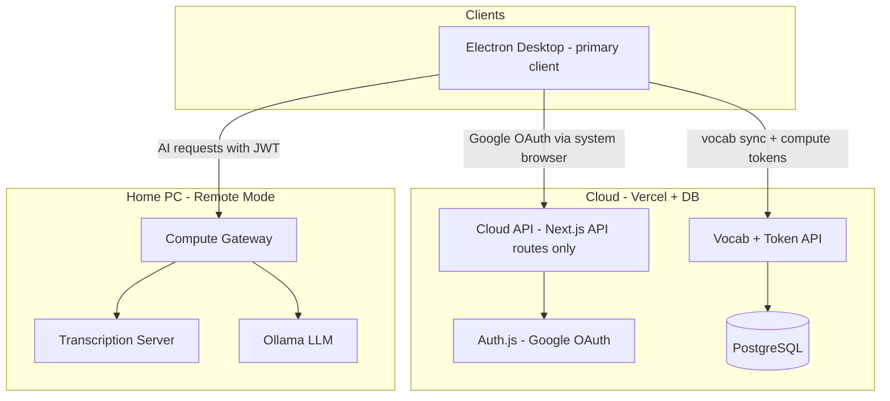
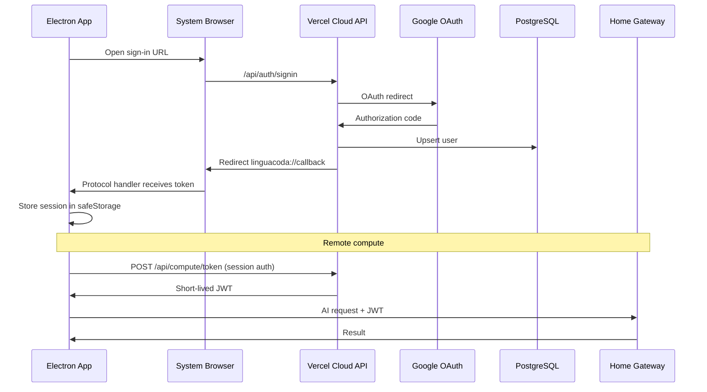

# LinguaCoda AI — Architecture

This document describes the system design for LinguaCoda: the Electron desktop app as the **primary and only end-user client**, the cloud services that back accounts and persistence, and the optional home compute server for shared AI workloads.

---

## Table of Contents

1. [Overview](#overview)
2. [Why Electron, Not a Browser](#why-electron-not-a-browser)
3. [Production Target Architecture](#production-target-architecture)
4. [Recommended Additions & Modifications](#recommended-additions--modifications)
5. [Component Responsibilities](#component-responsibilities)
6. [Authentication & Sessions](#authentication--sessions)
7. [Data Model & Vocab Sync](#data-model--vocab-sync)
8. [Home Compute Gateway (Remote Backend)](#home-compute-gateway-remote-backend)
9. [Cloud API (Vercel)](#cloud-api-vercel)
10. [Security](#security)
11. [Concurrency & Rate Limiting](#concurrency--rate-limiting)
12. [Desktop Client (Electron)](#desktop-client-electron)
13. [AI Components](#ai-components)
14. [Data Flows](#data-flows)
15. [Configuration & Persistence](#configuration--persistence)
16. [Migration Phases](#migration-phases)
17. [Error Handling & Resilience](#error-handling--resilience)

---

## Overview

LinguaCoda is a language-learning app centered on **real-time transcription**, **translation**, **semantic alignment**, and an **HSK vocab tracker**.

The **Electron desktop app is the product**. It is the only client users install and run. It retains full **WASAPI** access (microphone + system/loopback audio), the existing Python audio backend, and the current renderer UI — extended with Google sign-in and cloud vocab sync.

Production adds two server-side tiers; neither replaces the desktop UI:

| Tier | Host | Role |
|------|------|------|
| **Electron desktop** | User's machine | Full UI, WASAPI capture, IPC to local or remote AI |
| **Cloud API** | Vercel (serverless) | Google OAuth callbacks, vocab read/write, compute token issuance |
| **Home compute gateway** | Operator's PC (optional remote mode) | Shared GPU/CPU AI: SenseVoice ASR, SimAlign, Ollama |



**Why split this way:** SenseVoice, SimAlign/XLM-R, and Ollama are too heavy for Vercel serverless. User accounts and vocab state belong in a managed database. **WASAPI loopback capture requires native desktop access** — browsers cannot reliably provide system-audio capture across Windows versions, and supporting Chrome/Firefox/Safari separately would multiply effort for an inferior experience.

---

## Why Electron, Not a Browser

| Concern | Electron desktop | Web browser |
|---------|------------------|-------------|
| **WASAPI loopback** (capture system/app audio) | Yes — `electron_backend.py` / `soundcard_capture.py` | No — OS and browser security model blocks this |
| **Microphone capture** | Yes | Yes, but not the primary use case |
| **Single runtime to test** | Chromium via Electron | Chrome, Firefox, Safari, mobile… |
| **Existing codebase** | `renderer.js`, IPC, Python backend already work | Full UI + audio stack would need a rewrite |
| **Offline vocab** | `localStorage` + local draft | Same possible, but no WASAPI benefit |
| **Distribution** | Installer / portable app | URL, but feature-incomplete |

**Decision:** Do not port the Language Learning Suite UI to a browser. Vercel hosts **API routes and OAuth callbacks only** — not the transcription/subtitles experience. A minimal landing or download page on Vercel is optional.

---

## Production Target Architecture

### Goals

1. **Remote backend flag** — run dedicated AI backend on a personal PC, reachable from the internet, with tunneling, rate limits, and support for multiple concurrent **Electron** sessions.
2. **Electron remains the client** — users install and run the desktop app; all capture and UI stay in Electron.
3. **Google OAuth** — external identity provider only (no custom passwords in v1).
4. **Per-user database** — vocab tracker state persists across devices (multiple desktops/laptops); batch sync on app close (not per-character).

### High-level request paths

**Auth (one-time per session):**
```
Electron → system browser → Vercel /api/auth/* → Google → callback → linguacoda:// or token handoff → Electron
```

**Vocab (cloud):**
```
Electron main/renderer → Vercel /api/vocab → PostgreSQL
```

**AI compute (local or remote):**
```
# Same machine (default / dev)
Electron → IPC → Python backend → transcription_server (loopback)
Electron → IPC → main.js → Ollama (loopback)

# Remote mode (shared home server)
Electron → HTTPS → Home Compute Gateway → transcription_server / Ollama (loopback on server)
```

---

## Recommended Additions & Modifications

### 1. Unified Compute Gateway (instead of exposing `transcription_server.py` directly)

Wrap the transcription server and Ollama in a **Compute Gateway**:

- Validates **user JWTs** (issued by the Vercel cloud API after Google login).
- Applies **rate limiting** and **request size limits**.
- Proxies `/transcribe`, `/align`, and Ollama-backed `/translate`, etc.
- Exposes `--remote` / `LINGUACODA_REMOTE_MODE=1`.

The local Bearer token (`.transcription_server.token`) stays **loopback-only** on the home PC.

### 2. Cloudflare Tunnel over raw port forwarding

Expose the home gateway via **Cloudflare Tunnel** — no open router ports, HTTPS, edge DDoS protection.

### 3. Slim cloud API on Vercel (not a full web app)

Deploy a minimal **Next.js API app** (`services/cloud-api/` or `apps/api/`):

- Auth.js Google OAuth routes
- `GET/PUT /api/vocab`
- `POST /api/compute/token` — short-lived JWT for the home gateway
- Optional: static landing page with download link

**Do not** port `renderer.js`, subtitles UI, or audio capture to the web.

### 4. Electron auth via system browser + custom protocol

Use the OS default browser for Google OAuth (most secure, no embedded WebView cookie issues):

1. Electron opens `https://api.linguacoda.app/api/auth/signin` (or dedicated `/auth/desktop`).
2. After Google login, Vercel redirects to `linguacoda://auth/callback?...`.
3. Electron registers the `linguacoda://` protocol handler in `main.js`.
4. Session token stored via `safeStorage` or encrypted file.

### 5. Compute routing modes in Electron

| Mode | When | Transcription | Translation / align |
|------|------|---------------|---------------------|
| **Local** | Dev or single-user home PC | Python backend → local `transcription_server` | `main.js` → local Ollama |
| **Remote** | Client on different machine than AI server | `main.js` or backend → remote gateway `/transcribe` | gateway `/translate`, `/align` |

Config in `electron-config.json`: `computeMode: "local" | "remote"`, `cloudApiBaseUrl`, `computeGatewayUrl`.

### 6. Vocab conflict resolution

Per-word max merge across devices:

```
merged[word] = max(local[word], remote[word])
```

### 7. Debounced backup sync (in addition to close-batch)

Sync vocab on:

- App window close (`before-quit` / `window-close` IPC)
- Debounced every **5 minutes** during active use
- Manual "Sync now" in settings (optional)

### 8. Offline / home-PC-down UX

Vocab tracker and HSK dictionary work offline. Transcription/translation show **"Compute server offline"** when remote gateway is unreachable; local mode unaffected.

### 9. Do not persist LLM-derived caches in the database (v1)

Only sync **`seenVocab`**. Keep `pinyinCache` and `flashcardEntryCache` in `localStorage`.

---

## Component Responsibilities

### Electron Desktop (primary client — repo root)

**Unchanged core:**
- `main.js` — window, IPC, process lifecycle
- `renderer.js` — full UI (menu, subtitles, vocab, flashcards)
- `preload.js` — `window.electronAPI` bridge
- `electron_backend.py` — WASAPI capture, buffering, transcription client
- `index.html`, `styles.css`

**New / extended:**
- Google sign-in UI (settings or menu)
- Cloud vocab sync module (renderer + IPC helpers in main)
- Compute mode switch: local vs remote gateway
- Remote mode: main process obtains compute JWT from cloud API, attaches to gateway requests
- Protocol handler: `linguacoda://`

### Cloud API (Vercel — minimal Next.js)

| Route | Purpose |
|-------|---------|
| `GET/POST /api/auth/*` | Auth.js Google OAuth |
| `GET /api/vocab` | Fetch user's `seenVocab` blob |
| `PUT /api/vocab` | Upsert vocab blob (batch, max merge) |
| `POST /api/compute/token` | Issue short-lived JWT for home gateway |
| `GET /api/health` | DB connectivity check |
| `GET /auth/desktop-callback` | OAuth handoff page for Electron (optional) |

No subtitles, no audio, no vocab grid UI on Vercel.

### Database (PostgreSQL)

Neon, Supabase, or Vercel Postgres.

### Home Compute Gateway (`services/compute_gateway/`)

| Flag | Behavior |
|------|----------|
| Default (local) | `127.0.0.1`; Electron on same machine uses directly |
| `--remote` | Behind Cloudflare Tunnel; JWT required; rate limits |

Proxies to `transcription_server.py` and Ollama. Auth is **JWT-based** (not browser CORS) — Electron main process sends `Authorization: Bearer`.

### Transcription Server (existing — `transcription_server.py`)

Unchanged. Stays on `127.0.0.1:8765` on the home PC; only the gateway talks to it in production.

---

## Authentication & Sessions



- **Cloud session**: API key or refresh token stored in Electron `safeStorage`; sent as `Authorization: Bearer` or cookie on vocab/token requests from main process.
- **Compute JWT**: 15-minute HS256 token from `/api/compute/token`; used only for home gateway.
- **No passwords** in v1.

---

## Data Model & Vocab Sync

### Schema (v1)

```sql
CREATE TABLE users (
  id            TEXT PRIMARY KEY,
  email         TEXT UNIQUE NOT NULL,
  name          TEXT,
  image         TEXT,
  google_sub    TEXT UNIQUE,
  created_at    TIMESTAMPTZ DEFAULT now()
);

CREATE TABLE user_vocab (
  user_id     TEXT PRIMARY KEY REFERENCES users(id) ON DELETE CASCADE,
  seen_vocab  JSONB NOT NULL DEFAULT '{}',
  updated_at  TIMESTAMPTZ NOT NULL DEFAULT now()
);
```

### Sync protocol (Electron)

1. **On login**: `GET /api/vocab` → merge with `localStorage` draft (per-word max).
2. **During session**: `trackVocabFromText` updates in-memory + local draft.
3. **On sync trigger** (app close, 5-min debounce): `PUT /api/vocab`.
4. **Server merge**: per-word max; update `updated_at`.

### What stays local-only

| Data | Storage | Synced? |
|------|---------|---------|
| `seenVocab` | PostgreSQL | Yes |
| `pinyinCache` | localStorage | No (v1) |
| `flashcardEntryCache` | localStorage | No (v1) |
| Font size / zoom | local file / localStorage | No |
| Audio device selection | `device_cache.json` | No |

---

## Home Compute Gateway (Remote Backend)

### Startup

```bash
# Local (Electron on same machine)
python -m services.compute_gateway.main

# Remote (internet-facing via Cloudflare Tunnel)
LINGUACODA_REMOTE_MODE=1 \
JWT_SECRET=... \
python -m services.compute_gateway.main --remote
```

### API surface

| Method | Path | Auth | Proxies to |
|--------|------|------|------------|
| `GET` | `/health` | Optional | Gateway + downstream readiness |
| `POST` | `/transcribe` | JWT | `transcription_server:8765/transcribe` |
| `POST` | `/align` | JWT | `transcription_server:8765/align` |
| `POST` | `/translate` | JWT | Ollama `/api/generate` |
| `POST` | `/vocab-context` | JWT | Ollama |
| `POST` | `/flashcard-entry` | JWT | Ollama |

No WebSocket required for v1 — Electron can keep REST-per-chunk via main process or Python backend, same as today.

### Infrastructure on home PC

```
Internet → Cloudflare Tunnel → compute_gateway:8080
                                    ↓ loopback
                          transcription_server:8765
                                    ↓ loopback
                               Ollama:11434
```

---

## Cloud API (Vercel)

### Repository layout (target)

```
linguacoda_ai/
├── main.js, renderer.js, ...     # Electron app (primary client)
├── electron_backend.py
├── transcription_server.py
├── services/
│   ├── cloud-api/                # Minimal Next.js — Vercel root
│   │   ├── app/api/
│   │   └── auth.ts
│   └── compute_gateway/          # Python — home PC AI entry point
└── ARCHITECTURE.md
```

### Environment variables

**Vercel (cloud API):**
- `AUTH_SECRET`, `GOOGLE_CLIENT_ID`, `GOOGLE_CLIENT_SECRET`, `AUTH_URL`
- `DATABASE_URL`
- `JWT_SECRET` (shared with home gateway)

**Electron (`electron-config.json` or env):**
- `cloudApiBaseUrl` — e.g. `https://api.linguacoda.app`
- `computeMode` — `local` | `remote`
- `computeGatewayUrl` — tunnel URL when remote

**Home PC:**
- `LINGUACODA_REMOTE_MODE=1`, `JWT_SECRET`, `OLLAMA_ENDPOINT`, `OLLAMA_MODEL`
- `MAX_CONCURRENT_TRANSCRIPTIONS`

---

## Security

| Concern | Mitigation |
|---------|------------|
| Open AI endpoints | JWT on every compute request in remote mode |
| Local transcription token leaked | `.transcription_server.token` loopback-only on home PC |
| DDoS / abuse | Cloudflare Tunnel + gateway rate limits + max body size |
| Electron token storage | `safeStorage` / encrypted file; never log tokens |
| Data isolation | Vocab scoped by authenticated `user_id` |
| Secrets in repo | `.env` / Vercel env / home PC env only |

CORS is **not** the primary security boundary for compute — Electron calls from main process are not browser CORS requests. JWT validation is.

---

## Concurrency & Rate Limiting

| Limit | Suggested value | Behavior |
|-------|-----------------|----------|
| Max concurrent `/transcribe` | 2–3 | Queue or `429` |
| Max concurrent Ollama calls | 1–2 | Serialize |
| Rate limit per user (JWT sub) | 60 req/min | Gateway sliding window |
| Max audio payload | 5 MB per chunk | `413` |

---

## Desktop Client (Electron)

### Current architecture (main branch)

- **Main process (`main.js`)**: window, Python backend spawn, IPC, Ollama calls.
- **Renderer (`renderer.js`)**: UI, pairs, vocab, flashcards.
- **Python backend (`electron_backend.py`)**: WASAPI capture, transcription client.
- **Transcription server (`transcription_server.py`)**: ASR + alignment.

**IPC is the seam:** renderer → `preload.js` → `ipcMain` → Python backend / transcription server / Ollama.

### Production extensions

| Area | Change |
|------|--------|
| Auth | Sign in with Google via system browser + `linguacoda://` callback |
| Vocab | Cloud sync via `/api/vocab`; `localStorage` as offline draft |
| Compute | `local` mode unchanged; `remote` mode routes AI through gateway |
| WASAPI | **No change** — remains the reason Electron is the client |

---

## AI Components

| Subsystem | Local mode | Remote mode |
|-----------|------------|-------------|
| **ASR (SenseVoice)** | Python backend → local transcription server | Electron/backend → gateway → transcription server |
| **Alignment (SimAlign)** | main.js → local `/align` | main.js → gateway `/align` |
| **LLM (Ollama)** | main.js → local Ollama | main.js → gateway → Ollama |

Prompts and model config stay as in `main.js` and `electron-config.json`; gateway rehosts them in remote mode.

---

## Data Flows

### Electron local mode (unchanged)

1. Renderer → `startCapture` IPC → Python backend (WASAPI).
2. Backend → `POST /transcribe` on local transcription server.
3. Backend stdout → main → renderer event.
4. Renderer → `translateText` IPC → Ollama.
5. `trackVocabFromText` → memory + local draft → cloud sync on close.

### Electron remote mode

1. Renderer → `startCapture` IPC → Python backend (WASAPI) — **capture stays local on client machine**.
2. Backend (or main) → `POST https://gateway/transcribe` with compute JWT + audio payload.
3. Gateway → home transcription server → result back to Electron.
4. Renderer → `translateText` IPC → main → gateway `/translate`.
5. Vocab sync → Vercel `/api/vocab` (unchanged).

**Important:** In remote mode, **audio is captured on the user's machine** (WASAPI) and **sent to the home server for ASR**. The Python backend may stay on the client for capture only, posting to the remote gateway instead of localhost.

### Vocab sync

1. Login → `GET /api/vocab`.
2. Session mutations in renderer memory.
3. Triggers: app close, 5-min debounce → `PUT /api/vocab`.

---

## Configuration & Persistence

| Setting | Electron local | Electron remote | Cloud API | Home gateway |
|---------|----------------|-----------------|-----------|--------------|
| Capture | WASAPI via Python backend | WASAPI via Python backend | N/A | N/A |
| Transcription | `127.0.0.1:8765` | `computeGatewayUrl` | N/A | loopback |
| Ollama | `electron-config.json` | via gateway | N/A | loopback |
| Vocab | cloud + localStorage draft | cloud + localStorage draft | PostgreSQL | N/A |
| Auth | safeStorage token | safeStorage token | Auth.js | JWT validation |

---

## Migration Phases

### Phase 1 — Cloud API + Electron auth & vocab sync

- Minimal Next.js API on Vercel (auth + vocab only).
- PostgreSQL `user_vocab` table.
- Electron: Google sign-in, cloud vocab sync, batch on app close.
- No UI port to web. Transcription unchanged.

### Phase 2 — Compute gateway + remote mode

- `services/compute_gateway/` with `--remote` flag.
- Cloudflare Tunnel on home PC.
- `POST /api/compute/token` on Vercel.
- Electron: `computeMode: remote` routes AI through gateway.

### Phase 3 — Polish & distribution

- Settings UI: account, compute mode, sync status.
- Installer / auto-update (optional).
- Offline and gateway-down UX.

### Phase 4 — Hardening

- Rate limits, logging, monitoring.
- Load testing with multiple concurrent Electron clients.

---

## Error Handling & Resilience

| Failure | Response |
|---------|----------|
| Home gateway offline | Electron banner; vocab still works; retry AI calls |
| Cloud API offline | Vocab uses local draft; show "signed in offline" or prompt re-login |
| Transcription server cold start | `/health` `ready: false`; existing loading UI |
| Ollama timeout | Show pair with transcription only |
| Vocab sync conflict | Per-word max merge |
| App killed before sync | localStorage draft; merge on next login |
| Rate limit hit | `429` with backoff message in UI |

---

## Extensibility Notes

- **New suite tools**: add to `renderer.js` / `index.html` as today.
- **New AI endpoints**: add to gateway + `main.js` IPC handler.
- **Multi-device**: same Google account, multiple Electron installs, shared vocab via cloud API.
- **Future web dashboard** (optional): read-only vocab stats on Vercel — not a substitute for the desktop app.

---

## Summary

The production system is **Electron-first**: the desktop app is the only client, preserving WASAPI loopback and the existing UI/IPC architecture. **Vercel hosts a slim cloud API** for Google OAuth, vocab persistence, and compute token issuance — not the Language Learning Suite UI. A **home compute gateway** (optional remote mode) shares AI workloads across multiple Electron sessions behind JWT auth and a Cloudflare Tunnel. Local mode continues to work for single-machine development and personal use.
