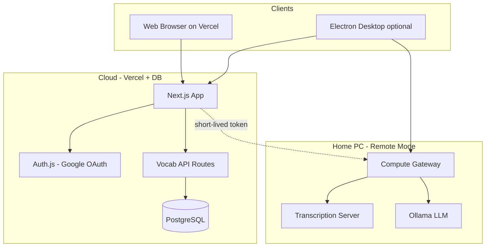
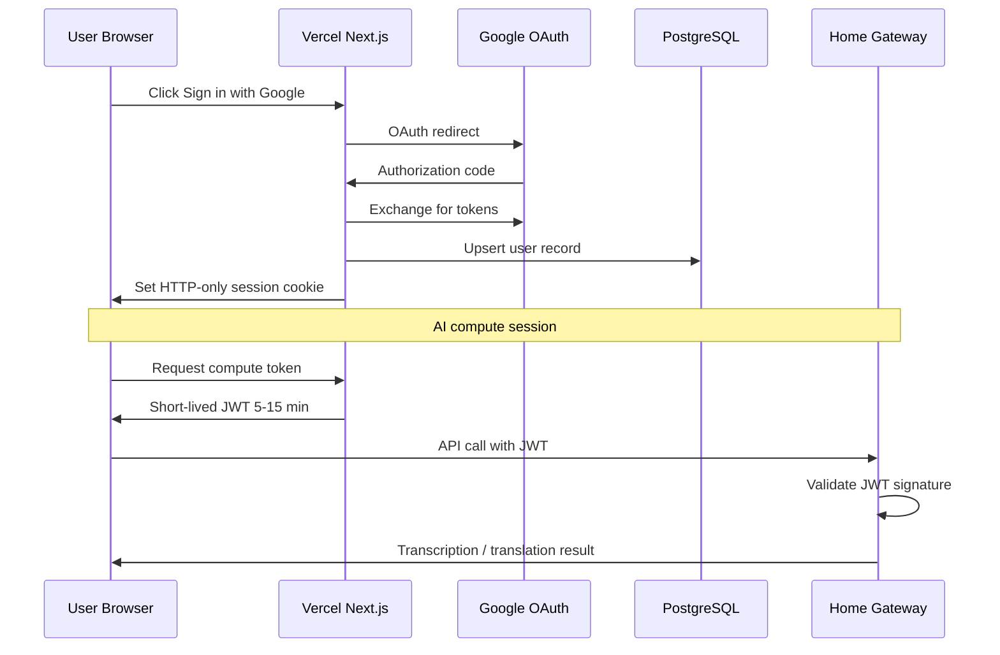
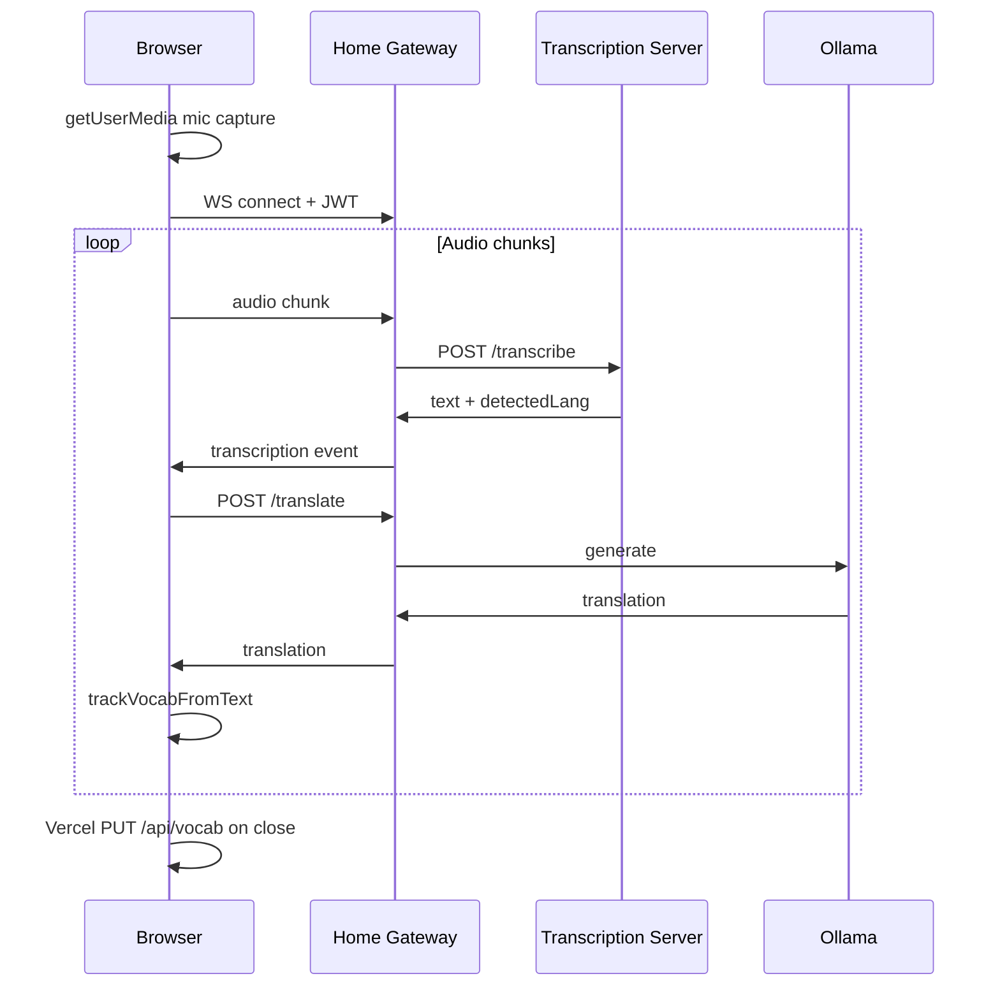

# LinguaCoda AI — Architecture

This document describes the system design for LinguaCoda: the current Electron desktop app, the target production deployment, and how the two coexist during migration.

---

## Table of Contents

1. [Overview](#overview)
2. [Production Target Architecture](#production-target-architecture)
3. [Recommended Additions & Modifications](#recommended-additions--modifications)
4. [Component Responsibilities](#component-responsibilities)
5. [Authentication & Sessions](#authentication--sessions)
6. [Data Model & Vocab Sync](#data-model--vocab-sync)
7. [Home Compute Gateway (Remote Backend)](#home-compute-gateway-remote-backend)
8. [Web Frontend (Vercel)](#web-frontend-vercel)
9. [Security](#security)
10. [Concurrency & Rate Limiting](#concurrency--rate-limiting)
11. [Desktop Client (Electron) — Current & Future](#desktop-client-electron--current--future)
12. [AI Components](#ai-components)
13. [Data Flows](#data-flows)
14. [Configuration & Persistence](#configuration--persistence)
15. [Migration Phases](#migration-phases)
16. [Error Handling & Resilience](#error-handling--resilience)

---

## Overview

LinguaCoda is a language-learning app centered on **real-time transcription**, **translation**, **semantic alignment**, and an **HSK vocab tracker**.

Today the project is an **Electron desktop app** where all compute (ASR, alignment, LLM translation) runs locally on the user's machine. The production target splits the system into three tiers:

| Tier | Host | Role |
|------|------|------|
| **Web client** | Vercel | Browser UI, Google login, per-user sessions, vocab persistence |
| **Cloud API** | Vercel (serverless) or managed DB host | Auth callbacks, vocab read/write, optional BFF proxy to home compute |
| **Home compute gateway** | Personal PC | GPU/CPU-heavy AI: SenseVoice ASR, SimAlign, Ollama translation |



**Why split this way:** SenseVoice, SimAlign/XLM-R, and Ollama are too heavy for Vercel serverless and require local GPU/CPU. User accounts and vocab state belong in a managed database. The browser cannot access loopback audio capture — that remains an Electron-only capability.

---

## Production Target Architecture

### Goals (from product requirements)

1. **Remote backend flag** — run dedicated AI backend on a personal PC, reachable from the public internet, with protection (tunneling, rate limits) and support for multiple concurrent frontend sessions.
2. **Web frontend on Vercel** — users log in and get their own session in the browser.
3. **Google OAuth** — external identity provider only (no custom passwords in v1).
4. **Per-user database** — vocab tracker state persists across devices; batch sync on session end (not per-character).

### High-level request paths

**Vocab (always cloud):**
```
Browser → Vercel API (/api/vocab) → PostgreSQL
```

**AI compute (home PC when online):**
```
Browser → Vercel BFF (optional) → Home Compute Gateway → Transcription Server / Ollama
```

The BFF (Backend-for-Frontend) on Vercel is recommended: it holds the home gateway URL as a server secret, mints short-lived compute tokens for authenticated users, and avoids exposing the home endpoint or long-lived secrets to the browser.

---

## Recommended Additions & Modifications

These go beyond the four stated requirements but address gaps that will surface in production.

### 1. Unified Compute Gateway (instead of exposing `transcription_server.py` directly)

Do **not** port-forward the raw transcription server to the internet. Wrap it in a **Compute Gateway** service that:

- Validates **user JWTs** (or short-lived compute tokens issued by Vercel after Google login).
- Applies **rate limiting**, **CORS**, and **request size limits** in one place.
- Proxies to the existing transcription server (`/transcribe`, `/align`) and Ollama (`/api/generate`).
- Exposes a single **`--remote`** / `LINGUACODA_REMOTE_MODE=1` entry point.

The existing local Bearer token (`.transcription_server.token`) stays **loopback-only** between the gateway and the transcription server.

### 2. Cloudflare Tunnel over raw port forwarding

Prefer a **Cloudflare Tunnel** (`cloudflared`) to expose the home gateway:

- No open inbound ports on the home router.
- Built-in DDoS mitigation and optional WAF/rate rules at the edge.
- Stable HTTPS hostname (e.g. `compute.yourdomain.com`) without dynamic DNS.

If port forwarding is used instead, restrict source IPs where possible, terminate TLS at a reverse proxy (Caddy/nginx), and never bind AI services to `0.0.0.0` without the gateway in front.

### 3. Next.js on Vercel (not a static SPA alone)

Use **Next.js** so Vercel can host:

- **Auth.js** Google OAuth callbacks (`/api/auth/*`).
- **Server-side vocab API** routes with DB credentials never shipped to the client.
- Optional **BFF proxy** to the home compute gateway.

A plain static export cannot securely hold database credentials or perform OAuth token exchange.

### 4. WebSocket or SSE for live transcription in the browser

The desktop app streams transcription over Electron IPC. The browser needs **WebSocket** or **Server-Sent Events** from the compute gateway for the same live experience. REST-only polling is a poor fit for continuous audio sessions.

### 5. Browser audio vs Electron audio

| Capability | Web (Vercel) | Electron |
|------------|--------------|----------|
| Microphone capture | `getUserMedia` | Yes |
| System/loopback audio | No (OS/browser restriction) | Yes (`electron_backend.py`) |
| Vocab tracker | Yes (cloud sync) | Yes (cloud sync) |
| Full subtitle pipeline | Yes (mic only) | Yes (mic + loopback) |

Document this limitation in the web UI so users know the desktop app is required for system-audio capture.

### 6. Vocab conflict resolution

With multiple devices, two sessions may update the same word offline. Use **last-write-wins at the document level** for v1 (simplest), or **per-word max count merge** (recommended):

```
merged[word] = max(local[word], remote[word])
```

Store a `updated_at` timestamp on the vocab blob for debugging and future CRDT work.

### 7. Debounced backup sync (in addition to close-batch)

Batch-on-close alone is risky (tab crash, mobile browser kill). Also sync:

- On `visibilitychange` → `hidden`
- On `beforeunload` / `pagehide` via `navigator.sendBeacon`
- Debounced every **5 minutes** during active use

### 8. Offline / home-PC-down UX

The vocab tracker and HSK dictionary can work offline (dictionary is static JSON). Transcription/translation should show a clear **“Compute server offline”** state with retry, since the home PC may sleep or lose power.

### 9. Keep Electron as a first-class client

Electron should adopt the same Google auth and cloud vocab sync, while retaining local loopback capture and optional direct loopback to the home gateway when running on the same machine.

### 10. Do not persist LLM-derived caches in the database (v1)

`pinyinCache` and `flashcardEntryCache` are regenerable. Only sync **`seenVocab`** (`{ word: count }`) to the database initially. This keeps payloads small and avoids stale LLM content across model versions.

---

## Component Responsibilities

### Web Frontend (Vercel — Next.js)

- Host the Language Learning Suite UI (ported from `renderer.js` / `index.html`).
- Google sign-in via Auth.js; maintain HTTP-only session cookie.
- Load HSK dictionary from static assets (same `hsk_dictionary.json`).
- Vocab tracker: read from DB on login, mutate in memory during session, batch sync on close/interval.
- Audio capture via Web Audio API / `MediaRecorder`; stream chunks to compute gateway.
- Pinyin generation via `pinyin-pro` in the browser (already a dependency) — no Ollama needed for basic pinyin.

### Cloud API (Vercel serverless routes)

| Route | Purpose |
|-------|---------|
| `GET/POST /api/auth/*` | Auth.js Google OAuth |
| `GET /api/vocab` | Fetch user's `seenVocab` blob |
| `PUT /api/vocab` | Upsert vocab blob (batch) |
| `POST /api/compute/token` | Issue short-lived JWT for home gateway (optional BFF) |
| `GET /api/health/compute` | Ping home gateway; surface online/offline to UI |

### Database (PostgreSQL)

Recommended hosts: **Neon**, **Supabase**, or **Vercel Postgres**. Single region close to the user base.

### Home Compute Gateway (new service on personal PC)

| Flag | Behavior |
|------|----------|
| Default (local) | Binds `127.0.0.1`; Electron/desktop use only |
| `--remote` / `LINGUACODA_REMOTE_MODE=1` | Binds behind tunnel; validates user tokens; enables CORS for Vercel origin |

Responsibilities:

- Authenticate requests (JWT from Auth.js or compute token from BFF).
- Rate limit per user and per IP.
- Queue concurrent ASR jobs (GPU-bound); return `429` when saturated.
- Proxy `/transcribe`, `/align` to `transcription_server.py` (loopback + local token).
- Proxy `/translate`, `/vocab-context`, `/flashcard-entry` to Ollama (same prompts as `main.js` today).
- WebSocket endpoint for streaming transcription events.

### Transcription Server (existing — `transcription_server.py`)

Unchanged in responsibility. In remote mode it remains **localhost-only** (`127.0.0.1:8765`); only the gateway talks to it.

### Electron Desktop (existing — evolution path)

Current responsibilities preserved. Future: add Google login, cloud vocab sync, and configurable compute endpoint (local gateway vs remote tunnel URL).

---

## Authentication & Sessions



**Auth.js (NextAuth v5)** with Google provider:

- **Session**: HTTP-only, Secure, SameSite=Lax cookie on the Vercel domain.
- **User record**: `id`, `email`, `name`, `image`, `google_sub`, `created_at`.
- **No passwords** in v1.

**Compute tokens** (recommended):

- Vercel signs a short-lived JWT after session validation.
- Home gateway validates with a shared `JWT_SECRET` (or JWKS if using asymmetric keys).
- Prevents anonymous internet access to expensive AI endpoints.

---

## Data Model & Vocab Sync

### Schema (v1)

```sql
-- Managed by Auth.js adapter
CREATE TABLE users (
  id            TEXT PRIMARY KEY,
  email         TEXT UNIQUE NOT NULL,
  name          TEXT,
  image         TEXT,
  google_sub    TEXT UNIQUE,
  created_at    TIMESTAMPTZ DEFAULT now()
);

CREATE TABLE user_vocab (
  user_id     TEXT PRIMARY KEY REFERENCES users(id) ON DELETE CASCADE,
  seen_vocab  JSONB NOT NULL DEFAULT '{}',  -- { "你好": 3, "谢谢": 1 }
  updated_at  TIMESTAMPTZ NOT NULL DEFAULT now()
);
```

`seen_vocab` mirrors today's `localStorage.seenVocab` shape: `{ [word: string]: number }`.

### Sync protocol

1. **On login**: `GET /api/vocab` → hydrate in-memory `seenVocab`; merge with any local draft using per-word max count.
2. **During session**: updates stay in memory (and optionally `localStorage` as a offline draft); `trackVocabFromText` behavior unchanged.
3. **On sync trigger** (close, hidden, debounce, beacon): `PUT /api/vocab` with full blob or delta + `updated_at`.
4. **Server merge**: `merged[w] = max(client[w], server[w])` per word; update `updated_at`.

### What stays local-only

| Data | Storage | Synced? |
|------|---------|---------|
| `seenVocab` | DB | Yes |
| `pinyinCache` | localStorage | No (v1) |
| `flashcardEntryCache` | localStorage | No (v1) |
| Font size / zoom | localStorage | No |
| Audio device selection | local (Electron) | No |

---

## Home Compute Gateway (Remote Backend)

### Startup

```bash
# Local desktop development (default)
python compute_gateway.py

# Production remote mode (behind Cloudflare Tunnel)
LINGUACODA_REMOTE_MODE=1 \
JWT_SECRET=... \
ALLOWED_ORIGINS=https://your-app.vercel.app \
python compute_gateway.py --remote
```

### Suggested API surface

| Method | Path | Auth | Proxies to |
|--------|------|------|------------|
| `GET` | `/health` | None | Gateway + downstream readiness |
| `POST` | `/transcribe` | JWT | `transcription_server:8765/transcribe` |
| `POST` | `/align` | JWT | `transcription_server:8765/align` |
| `POST` | `/translate` | JWT | Ollama `/api/generate` |
| `POST` | `/vocab-context` | JWT | Ollama (optional) |
| `WS` | `/stream` | JWT | Audio session streaming |

### Infrastructure on home PC

```
Internet → Cloudflare Tunnel → compute_gateway:8080
                                    ↓ loopback
                          transcription_server:8765
                                    ↓ loopback
                               Ollama:11434
```

Process supervision: **systemd** (Linux) or **NSSM** (Windows) to restart on failure. Health checks can ping `/health` from an external monitor (e.g. Uptime Kuma).

---

## Web Frontend (Vercel)

### Repository layout (target)

```
linguacoda_ai/
├── apps/
│   └── web/                 # Next.js app (Vercel root)
│       ├── app/
│       ├── components/      # Ported UI from renderer.js
│       └── lib/
│           ├── auth.ts
│           ├── vocab.ts
│           └── compute-client.ts
├── services/
│   └── compute_gateway/     # Python — remote AI entry point
├── transcription_server.py  # Unchanged ASR/align service
├── electron/                # Existing Electron app (optional move)
└── ARCHITECTURE.md
```

### Environment variables

**Vercel:**
- `AUTH_SECRET`, `GOOGLE_CLIENT_ID`, `GOOGLE_CLIENT_SECRET`
- `DATABASE_URL`
- `COMPUTE_GATEWAY_URL` (server-only)
- `JWT_SECRET` (shared with home gateway for compute tokens)

**Home PC:**
- `LINGUACODA_REMOTE_MODE=1`
- `JWT_SECRET` (same as Vercel)
- `ALLOWED_ORIGINS`
- `OLLAMA_ENDPOINT`, `OLLAMA_MODEL`
- `MAX_CONCURRENT_TRANSCRIPTIONS` (e.g. 2–3)

---

## Security

| Concern | Mitigation |
|---------|------------|
| Open AI endpoints | JWT on every compute request; no anonymous access in remote mode |
| Local transcription token leaked | Keep `.transcription_server.token` on loopback only; gateway holds it |
| DDoS / abuse | Cloudflare Tunnel + gateway rate limits + max body size on audio uploads |
| CORS | Allow only the Vercel production (and preview) origins |
| Session hijacking | HTTP-only Secure cookies; short compute token TTL |
| Data isolation | All vocab queries scoped by `user_id` from session; no client-supplied user IDs |
| Secrets in repo | `.env` / Vercel env / home PC env only; never commit |

---

## Concurrency & Rate Limiting

The home PC has finite GPU/CPU. Recommended defaults:

| Limit | Suggested value | Behavior |
|-------|-----------------|----------|
| Max concurrent `/transcribe` | 2–3 | Queue or `429 Too Many Requests` |
| Max concurrent Ollama calls | 1–2 | Serialize translation to protect VRAM |
| Rate limit per user | 60 req/min | Sliding window at gateway |
| Rate limit per IP | 120 req/min | Edge or gateway |
| Max audio payload | 5 MB per chunk | Reject oversize with `413` |

Expose queue depth or estimated wait in `/health` so the UI can set expectations when multiple users are active.

---

## Desktop Client (Electron) — Current & Future

### Current architecture (main branch)

The project is an **Electron desktop app** with:

- **Electron Main Process (`main.js`)**: window lifecycle, Python backend spawn, IPC handlers, Ollama translation calls.
- **Electron Renderer (`renderer.js`)**: UI, transcription pairs, vocab tracker, flashcards.
- **Python Backend (`electron_backend.py`)**: audio capture, buffering, transcription client.
- **Transcription Server (`transcription_server.py`)**: SenseVoice ASR, SimAlign alignment.

At runtime:

1. Electron starts and creates a window.
2. Electron starts (or connects to) the transcription server.
3. Electron starts the Python backend as a child process.
4. Renderer drives capture over IPC; backend emits transcription JSON on stdout.
5. Main process translates via Ollama; renderer displays pairs and vocab tracking.

**IPC is the seam:** renderer → `preload.js` → `ipcMain` → Python backend / HTTP to transcription server / Ollama.

### Future Electron integration

- Add sign-in flow (embedded browser or deep link) sharing the same Auth.js app.
- Replace direct Ollama IPC with compute gateway client when `COMPUTE_GATEWAY_URL` is set.
- Vocab: load/sync via `/api/vocab` instead of only `localStorage`.
- Keep loopback audio capture as the differentiator over the web client.

---

## AI Components

Three distinct AI subsystems (unchanged in technology choice):

| Subsystem | Runtime (today) | Runtime (production) |
|-----------|-----------------|----------------------|
| **ASR (SenseVoice)** | `transcription_server.py` | Home PC transcription server |
| **Alignment (SimAlign + pkuseg)** | `transcription_server.py` `/align` | Home PC transcription server |
| **LLM (Ollama)** | Electron `main.js` | Home compute gateway → Ollama |

### ASR: SenseVoice

- Model: `SENSEVOICE_MODEL` in `config.py` (default `iic/SenseVoiceSmall`).
- Client sends base64 float32 audio; receives `{ transcription, detectedLang }`.

### LLM: Translation & learning features

- Ollama `POST /api/generate` with `ollamaModel` from config.
- Used for: translation, vocab context, flashcard entries.
- Prompts remain as implemented in `main.js` today; gateway rehosts them.

### Semantic alignment (detail view)

- `POST /align` with `{ transcription, translation }`.
- Pipeline: strip parentheticals → pkuseg / whitespace tokenization → SimAlign (XLM-R, IterMax).
- Returns `{ transcriptionChunks, translationChunks, correlations }`.

---

## Data Flows

### Web: Audio → Transcription → Translation



### Desktop: Audio → Transcription (current)

1. Renderer → `startCapture` IPC → Python backend stdin.
2. Backend buffers audio → `TranscriptionClient` → `POST /transcribe`.
3. Backend stdout JSON → main process → renderer event.
4. Renderer splits sentences → `translateText` IPC → Ollama.
5. `trackVocabFromText` → `localStorage` (future: also cloud sync).

### Vocab sync (production)

1. Login → fetch `user_vocab.seen_vocab`.
2. Session mutations in memory.
3. Triggers: `pagehide`, `visibilitychange(hidden)`, 5-min debounce → `PUT /api/vocab`.

---

## Configuration & Persistence

| Setting | Desktop (today) | Web (target) | Remote gateway |
|---------|-------------------|--------------|----------------|
| Ollama endpoint | `electron-config.json` | N/A (server-side) | env `OLLAMA_ENDPOINT` |
| Transcription URL | `127.0.0.1:8765` | via gateway URL | loopback |
| Vocab | `localStorage.seenVocab` | PostgreSQL | N/A |
| Auth | N/A | Auth.js + Google | JWT validation |
| Device cache | `device_cache.json` | N/A | N/A |

---

## Migration Phases

### Phase 1 — Auth + vocab cloud (no remote compute)

- Next.js on Vercel with Google login.
- PostgreSQL `user_vocab` table.
- Port vocab tracker UI; batch sync on close.
- Transcription/translation disabled or mocked in web UI.

### Phase 2 — Compute gateway + tunnel

- Implement `compute_gateway.py` with `--remote` flag.
- Cloudflare Tunnel to home PC.
- BFF compute token route on Vercel.
- Web client: mic capture + live transcription.

### Phase 3 — Electron parity

- Electron uses same auth and vocab API.
- Optional: Electron talks to local gateway when on same machine.
- Loopback capture remains Electron-only.

### Phase 4 — Hardening

- Rate limits, monitoring, structured logging.
- Preview deployment auth restrictions.
- Load testing for concurrent sessions.

---

## Error Handling & Resilience

| Failure | Response |
|---------|----------|
| Home gateway offline | UI banner; vocab still works; queue failed compute retries |
| Transcription server cold start | `/health` shows `ready: false`; UI loading state (existing behavior) |
| Aligner not warmed up | `/health.alignerReady`; detail view shows loading (existing behavior) |
| Ollama timeout | Per-request timeout; show pair with transcription only |
| Vocab sync conflict | Per-word max merge; log `updated_at` mismatch |
| Tab killed before sync | `sendBeacon` on `pagehide`; localStorage draft as fallback |
| Rate limit hit | `429` with `Retry-After`; UI backoff message |

---

## Extensibility Notes

- **New suite tools**: add routes/views in Next.js app; shared components from renderer port.
- **New analyses per pair**: add gateway endpoint + client method.
- **Cache semantic units**: store on `transcriptionPairs[i]` client-side to avoid repeat `/align`.
- **Multi-user home server**: per-user JWT identity enables fair queuing and audit logs.
- **Future paid tier**: gate compute token issuance by subscription in Vercel BFF.

---

## Summary

The production system is a **three-tier architecture**: Vercel hosts the authenticated web experience and vocab persistence; a **home compute gateway** (remote mode) exposes AI capabilities behind JWT auth, rate limits, and preferably a Cloudflare Tunnel; the existing **transcription server** and **Ollama** stay on the home PC as internal services. Google OAuth provides identity; PostgreSQL stores per-user `seenVocab` with batch sync and multi-device merge. The Electron app remains the power-user client for loopback audio while sharing the same account and vocab data.
